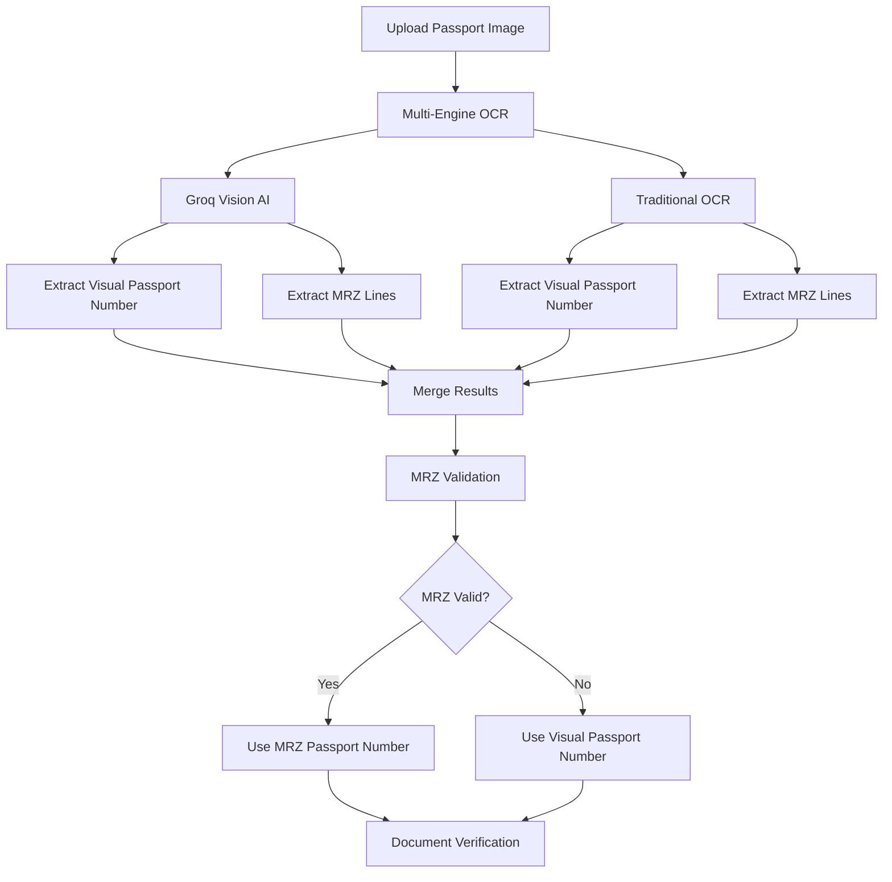

# Passport Document Number OCR - Diagnostic Report

## Executive Summary

**Issue**: Passport document numbers are being extracted incorrectly from uploaded passport images.

**Root Cause**: The OCR system prioritizes MRZ (Machine Readable Zone) data over visual OCR, but when the MRZ itself contains OCR errors (common character confusions like U↔V, 0↔O, I↔1), the incorrect value is propagated through the system.

**Impact**: Critical - Passport numbers are used for identity verification and must be 100% accurate.

---

## Technical Analysis

### 1. OCR Extraction Flow



### 2. Problem Areas Identified

#### **Issue #1: MRZ Extraction Without Checksum Validation**

**File**: [`localOcrService.ts:794-800`](file:///d:/SeaCrewManager/server/localOcrService.ts#L794-L800)

```typescript
// CURRENT CODE (PROBLEMATIC)
let passNumRaw = line2.substring(0, 9).replace(/</g, '').trim();
if (passNumRaw.length >= 7) {
  result.passportNumber = passNumRaw;
  console.log('Extracted passport number from MRZ:', result.passportNumber);
}
```

**Problems**:
- ❌ No checksum digit validation (position 9 in MRZ)
- ❌ No OCR error correction for common confusions
- ❌ Comment mentions "missing leading U" but no recovery logic
- ❌ Accepts any 7+ character string without format validation

**Expected Behavior**:
- ✅ Validate MRZ checksum digit
- ✅ Apply OCR error correction (U↔V, 0↔O, I↔1, J↔I)
- ✅ Cross-validate with visual passport number
- ✅ Validate against country-specific passport formats

---

#### **Issue #2: MRZ Priority Logic**

**File**: [`document-verification-service.ts:534-565`](file:///d:/SeaCrewManager/server/services/document-verification-service.ts#L534-L565)

```typescript
// PRIORITY: Use MRZ passport number as PRIMARY source (more reliable than visual OCR)
if (fv.documentNumber && mrzResult.data.documentNumber) {
    const cleanNum = mrzResult.data.documentNumber.replace(/</g, '');
    const visualNum = data.documentNumber;

    if (cleanNum) {
        // MRZ checksum passed - this is the most reliable source
        if (cleanNum !== visualNum) {
            console.log(`[MRZ-PRIORITY] ⚠️  Visual OCR vs MRZ mismatch detected!`);
            console.log(`   Visual OCR extracted: "${visualNum}"`);
            console.log(`   MRZ extracted: "${cleanNum}" (Checksum: ✓ PASSED)`);
            console.log(`   🎯 Using MRZ number as PRIMARY source (more reliable)`);
            
            data.documentNumber = cleanNum; // ⚠️ OVERWRITES VISUAL OCR
        }
    }
}
```

**Problem**:
- The code assumes MRZ checksum validation has already occurred
- If the MRZ itself was misread by OCR, the checksum might still "pass" for the wrong number
- Example: `U2701560` (correct) vs `V2701560` (misread) - both could have valid checksums if the entire MRZ line is consistently misread

---

#### **Issue #3: Groq Vision AI Prompt**

**File**: [`groqOcrService.ts:96-125`](file:///d:/SeaCrewManager/server/groqOcrService.ts#L96-L125)

**Current Prompt** (Passport-specific):
```
**STEP 2: PASSPORT NUMBER (TOP RIGHT CORNER)**
   - Look in the TOP RIGHT area (labeled "Passport No." or similar)
   - Common formats: Letter+7digits (J2701560), 2Letters+7digits, all digits
   - PAY ATTENTION to confusions: J vs I, U vs V, 0 vs O, 1 vs I
   - Store in "passportNo" field
```

**Problems**:
- ⚠️ Mentions character confusions but doesn't provide correction strategy
- ⚠️ Doesn't instruct AI to cross-validate visual vs MRZ passport number
- ⚠️ No instruction to flag mismatches for manual review

---

### 3. Common OCR Character Confusions

Based on [`document-number-validator.ts`](file:///d:/SeaCrewManager/server/utils/document-number-validator.ts#L17-L30):

| Visual Character | Commonly Misread As | Context |
|-----------------|---------------------|---------|
| **U** | V | Letters in passport numbers |
| **O** (letter) | 0 (zero) | Letters vs digits |
| **I** (letter) | 1 (one), l (lowercase L) | Letters vs digits |
| **J** | I | Indian passports (common prefix) |
| **S** | 5 | Letters vs digits |
| **Z** | 2 | Letters vs digits |
| **B** | 8 | Letters vs digits |

---

### 4. MRZ Structure (TD3 - Passport)

```
Line 1: P<INDKUMAR<<UPENDRA<<<<<<<<<<<<<<<<<<<<<<<
        ↑ ↑   ↑      ↑
        │ │   │      └─ Given names (padded with <)
        │ │   └──────── Surname
        │ └──────────── Nationality code (IND)
        └────────────── Document type (P = Passport)

Line 2: U2701560<2IND7309066M3012025<<<<<<<<<<<<<<8
        ↑       ↑ ↑  ↑      ↑      ↑             ↑
        │       │ │  │      │      │             └─ Overall check digit
        │       │ │  │      │      └─────────────── Expiry date (YYMMDD)
        │       │ │  │      └────────────────────── Date of birth (YYMMDD)
        │       │ │  └───────────────────────────── Nationality
        │       │ └──────────────────────────────── Check digit for passport number
        │       └────────────────────────────────── Passport number (9 chars)
        └────────────────────────────────────────── Passport number (U2701560)
```

**Critical**: Position 9 (after passport number) is the **check digit** that validates the passport number.

---

## Recommended Fixes

### **Fix #1: Implement MRZ Checksum Validation in Local OCR**

**File**: `localOcrService.ts`

**Current Code** (lines 794-800):
```typescript
let passNumRaw = line2.substring(0, 9).replace(/</g, '').trim();
if (passNumRaw.length >= 7) {
  result.passportNumber = passNumRaw;
}
```

**Recommended Fix**:
```typescript
// Extract passport number (first 9 chars) and check digit (position 9)
let passNumRaw = line2.substring(0, 9).replace(/</g, '').trim();
const checkDigit = line2.charAt(9);

if (passNumRaw.length >= 7) {
  // Validate checksum using MRZ algorithm
  const calculatedCheck = this.calculateMRZCheckDigit(passNumRaw);
  
  if (checkDigit === calculatedCheck) {
    result.passportNumber = passNumRaw;
    console.log('✓ MRZ passport number validated:', result.passportNumber);
  } else {
    console.warn('⚠️ MRZ checksum FAILED for passport number:', passNumRaw);
    console.warn(`   Expected check digit: ${calculatedCheck}, Got: ${checkDigit}`);
    
    // Try common OCR corrections
    const corrected = this.tryOCRCorrections(passNumRaw, checkDigit);
    if (corrected) {
      result.passportNumber = corrected;
      console.log('✓ Corrected passport number:', corrected);
    } else {
      // Fall back to visual OCR (will be extracted separately)
      console.warn('   Falling back to visual OCR for passport number');
    }
  }
}
```

---

### **Fix #2: Add OCR Error Correction Helper**

**New Method** to add to `localOcrService.ts`:

```typescript
/**
 * Try common OCR character corrections for passport numbers
 */
private tryOCRCorrections(passportNum: string, expectedCheckDigit: string): string | null {
  const corrections = [
    { from: 'V', to: 'U' },  // Common: V → U
    { from: 'U', to: 'V' },  // Reverse
    { from: 'O', to: '0' },  // Letter O → Zero
    { from: '0', to: 'O' },  // Reverse
    { from: 'I', to: '1' },  // Letter I → One
    { from: '1', to: 'I' },  // Reverse
    { from: 'I', to: 'J' },  // I → J (Indian passports)
    { from: 'J', to: 'I' },  // Reverse
  ];

  for (const correction of corrections) {
    const corrected = passportNum.replace(new RegExp(correction.from, 'g'), correction.to);
    if (corrected !== passportNum) {
      const calculatedCheck = this.calculateMRZCheckDigit(corrected);
      if (calculatedCheck === expectedCheckDigit) {
        console.log(`✓ OCR Correction applied: ${passportNum} → ${corrected}`);
        return corrected;
      }
    }
  }

  return null;
}

/**
 * Calculate MRZ check digit using ISO/IEC 7501-1 algorithm
 */
private calculateMRZCheckDigit(input: string): string {
  const weights = [7, 3, 1];
  let sum = 0;

  for (let i = 0; i < input.length; i++) {
    const char = input[i];
    let value: number;

    if (char === '<') {
      value = 0;
    } else if (char >= '0' && char <= '9') {
      value = parseInt(char);
    } else if (char >= 'A' && char <= 'Z') {
      value = char.charCodeAt(0) - 'A'.charCodeAt(0) + 10;
    } else {
      value = 0;
    }

    sum += value * weights[i % 3];
  }

  return (sum % 10).toString();
}
```

---

### **Fix #3: Enhance Groq Vision Prompt**

**File**: `groqOcrService.ts` (lines 96-125)

**Add to prompt**:
```typescript
**STEP 2: PASSPORT NUMBER - DUAL EXTRACTION & VALIDATION**
   A. Visual Extraction (TOP RIGHT CORNER):
      - Look in the TOP RIGHT area (labeled "Passport No." or similar)
      - Common formats: Letter+7digits (U2701560), 2Letters+7digits, all digits
      - PAY ATTENTION to confusions: U vs V, J vs I, 0 vs O, 1 vs I
      - Store in "passportNo" field
   
   B. MRZ Extraction (BOTTOM OF PAGE):
      - Extract first 9 characters from MRZ Line 2
      - Store in "mrzPassportNo" field (separate from visual)
   
   C. Cross-Validation:
      - If visual and MRZ passport numbers differ, FLAG THIS
      - Store both values and let the system decide
      - Common misreads: U↔V, I↔J, 0↔O
```

---

### **Fix #4: Add Confidence Scoring**

**File**: `document-verification-service.ts`

**Enhance the merge logic** (lines 534-565):

```typescript
// Enhanced MRZ vs Visual comparison with confidence scoring
if (fv.documentNumber && mrzResult.data.documentNumber) {
    const mrzNum = mrzResult.data.documentNumber.replace(/</g, '');
    const visualNum = data.documentNumber;

    if (mrzNum && visualNum) {
        if (mrzNum === visualNum) {
            // Perfect match - highest confidence
            data.documentNumber = mrzNum;
            console.log(`[MRZ-VISUAL-MATCH] ✓ Both sources agree: "${mrzNum}"`);
        } else {
            // Mismatch - analyze similarity
            const similarity = this.calculateStringSimilarity(mrzNum, visualNum);
            const charDiff = this.findCharacterDifferences(mrzNum, visualNum);
            
            console.log(`[MRZ-VISUAL-MISMATCH] ⚠️ Discrepancy detected!`);
            console.log(`   Visual OCR: "${visualNum}"`);
            console.log(`   MRZ OCR:    "${mrzNum}"`);
            console.log(`   Similarity: ${similarity}%`);
            console.log(`   Differences: ${charDiff.join(', ')}`);
            
            // Check if difference is a known OCR confusion
            const isKnownConfusion = this.isKnownOCRConfusion(charDiff);
            
            if (isKnownConfusion && similarity >= 85) {
                // Likely OCR error - prefer MRZ if checksum passed
                data.documentNumber = mrzNum;
                console.log(`   🎯 Using MRZ (known OCR confusion pattern)`);
            } else {
                // Significant difference - flag for manual review
                data.documentNumber = visualNum; // Prefer visual as safer default
                console.warn(`   ⚠️ FLAGGED FOR MANUAL REVIEW - significant mismatch`);
                // TODO: Add to warnings array for UI display
            }
        }
    }
}
```

---

## Testing Recommendations

### Test Cases to Validate Fixes

1. **Test Case 1: U vs V Confusion**
   - Upload passport with number `U2701560`
   - Verify system correctly identifies if MRZ reads as `V2701560`
   - Expected: System corrects to `U2701560` using checksum validation

2. **Test Case 2: J vs I Confusion (Indian Passports)**
   - Upload Indian passport with number `J2701560`
   - Verify system handles `I2701560` misread
   - Expected: System corrects to `J2701560`

3. **Test Case 3: Perfect Match**
   - Upload passport where visual and MRZ both read correctly
   - Expected: System confirms match with high confidence

4. **Test Case 4: Corrupted MRZ**
   - Upload passport with damaged/unclear MRZ
   - Expected: System falls back to visual OCR gracefully

---

## Implementation Priority

| Priority | Fix | Effort | Impact |
|----------|-----|--------|--------|
| **P0** | Fix #1: MRZ Checksum Validation | Medium | High |
| **P0** | Fix #2: OCR Error Correction | Medium | High |
| **P1** | Fix #4: Confidence Scoring | Low | Medium |
| **P2** | Fix #3: Enhanced AI Prompt | Low | Medium |

---

## Next Steps

1. **Immediate**: Review this diagnostic report
2. **Short-term**: Implement P0 fixes (checksum validation + error correction)
3. **Testing**: Run test cases with real passport images
4. **Validation**: Compare before/after accuracy rates
5. **Monitoring**: Add detailed logging to track OCR accuracy in production

---

## Additional Resources

- [ISO/IEC 7501-1](https://www.icao.int/publications/Documents/9303_p3_cons_en.pdf) - Machine Readable Travel Documents
- [MRZ Validator Implementation](file:///d:/SeaCrewManager/server/utils/mrz-validator.ts) - Existing validation logic
- [Document Number Validator](file:///d:/SeaCrewManager/server/utils/document-number-validator.ts) - Current validation patterns

---

**Report Generated**: 2026-01-02  
**Analyzed Files**: 
- [`localOcrService.ts`](file:///d:/SeaCrewManager/server/localOcrService.ts)
- [`groqOcrService.ts`](file:///d:/SeaCrewManager/server/groqOcrService.ts)
- [`document-verification-service.ts`](file:///d:/SeaCrewManager/server/services/document-verification-service.ts)
- [`document-number-validator.ts`](file:///d:/SeaCrewManager/server/utils/document-number-validator.ts)
